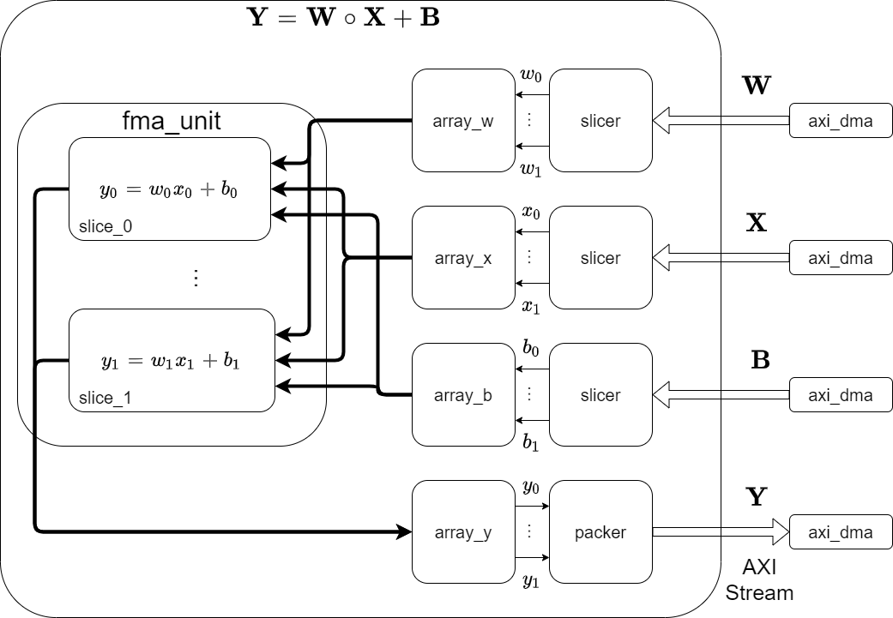

# FMAUnit4PYNQ  

## Overview  

このプロジェクトはPYNQ-Z2のPL上にFMAユニットを搭載して計算するだけのお遊びプロジェクトです。

## Requirements

- TUL PYNQ-Z2 Board
- PYNQ v2.6
- Vivado 2020.1 (Linux ver.)
- Vitis HLS 2020.1 (Linux ver.)

## Reference

- [HLSコード](https://www.shtsno24.tokyo/2022/03/pynqvitis-hlsfmaip1hls.html)  
- [高位合成・回路作成](https://www.shtsno24.tokyo/2022/03/pynqvitis-hlsfmaip2.html)  
- [実機実行](https://www.shtsno24.tokyo/2022/03/pynqvitis-hlsfmaip3.html)  
- [発生したトラブル](https://www.shtsno24.tokyo/2022/03/pynqvitis-hlsfmaip4.html)

## License  

These Codes are licensed under the Apache License, Version2.0.  
See [./LICENSE](./LICENSE)